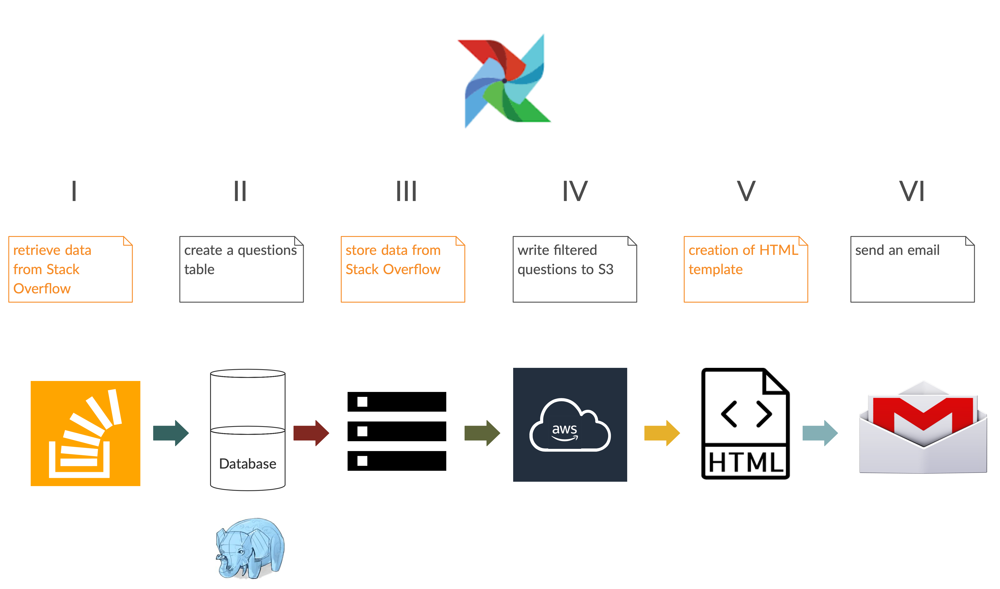

# How To Best Learn Python?

Helping newbie Pythonistas discern how to best use their study time.

## Time and Energy The Most Precious Resources

As newbie and longterm coders weigh out how to best utilize their time in the 
the sharpening of their programming skills and exploring new aspects of the
current language/s that they know, and maybe begining to explore new languages 
to acquire, how to best use their time and energy are key factors to take into
account. However, much guidance can be drawn from leveraging a popular tool 
already in use as source for crowdsourcing solutions, Stack Overflow. 
.

---

## Solution

The solution that will provide the guidance to develop and effective study 
strategy to the Pythonista exists by leveraging a popular tool that is already
in use as a source for crowedsourcing solutions, we introduce to you to: 
StackSource. 

StackSource filters through questions that are posted to the Stack Overflow site
that pertain to the specific language or tool that the user is currently exploring.

---

## Stack Overflow

" Stack Overflow is a question and answer site for professional and enthusiast
programmers. It is a privately held website, the flagship site of the Stack
Exchange Network, created in 2008 by Jeff Atwood and Joel Spolsky. It features
questions and answers on a wide range of topics in computer programming. It was
created to be a more open alternative to earlier question and answer sites such
as Experts-Exchange. The name for the website was chosen by voting in April 2008
by readers of Coding Horror, Atwood's popular programming blog. "

" The website serves as a platform for users to ask and answer questions, and, 
through membership and active participation, to vote questions and answers up or 
down and edit questions and answers in a fashion similar to a wiki or Reddit. Users 
of Stack Overflow can earn reputation points and "badges"; for example, a person is 
awarded 10 reputation points for receiving an "up" vote on an answer given to a 
question and 10 points for the "up" vote of a question, and can receive badges 
for their valued contributions, which represents a gamification of the traditional 
Q&A site. Users unlock new privileges with an increase in reputation like the 
ability to vote, comment, and even edit other people's posts. All user-generated 
content is licensed under Creative Commons Attribute-ShareAlike license, version 3.0 
or 4.0 depending on the date the content was contributed. "

---

## Stack Source

StackSource utilizes croud sourcing questions that are being encountered by 
programmers and presents that information to the user to guide their own self 
development. In particular Stack Source only considers the questions for the 
parameters that the user inputs, designating fields of interest. The data retrieved 
from Stack Overflowdoes contain some sparse data, and part of the process within 
Stack Source, is to filter out sparse data and extract the useful data.

Relevancy and usefulness of questions are taken into account, allowing the user to 
designa versatile study program. The rating of the questions is determined by Stack 
Overflow users. 

The questions for a particular topic are tracked, sorted by ratings, and the subjects 
of interest are consolidated and grouped by date, and emailed out to the Stack Source user. 

---

## How To Guide Your Learning Using Stack Source

1. Choosing a Learning Project
- Prioritize foundational skills: solidify your basic coding skills by researching and
answering questions that other users have posted. 
- Explore adjacent disciplines: explore how are readers utilizing their coding skills, what
kind of projects are they working on, what kind of compatible libraries or applications are 
they utilizing in their work. 
- Focus on transferable skills: lazer in into the areas of study that will benefit you in 
your day to day work. 

2. Designing a Learning Plan
- Define your learning objectives: set clear goals on what outcomes you would like to achieve.
- Identify project milestones: divide and conquer so you can make steady progress without 
getting intimidated.
- Develop a curriculum: find materials that you would enjoy according to your learning 
patterns. Consult experts to validate your curriculum.

---

## ETL Pipeline

I: New Stack Source updates are acquired from the Stack Overflow. 

II: A Python script processes the data and places it in a PostgreSQL database. 

III: Store data from Stack Overflow in an Amazon S3 bucket.

IV: Write filtered questions to S3.

V: Creation of an email utilizing a preset HTML template and sorted data. 

VI: The results are received in a daily email with the day's most
relevant questions.

---

## Installation

Things that need to be installed and running

- PostgreSQL Database
- Airflow
- Python
- sqlalchemy
- PostgreSQL Database
- pandas
- psycopg2
- pandasql

---

## Presentation link

Link to [Stack Source presentation](https://bit.ly/3a26hmV)